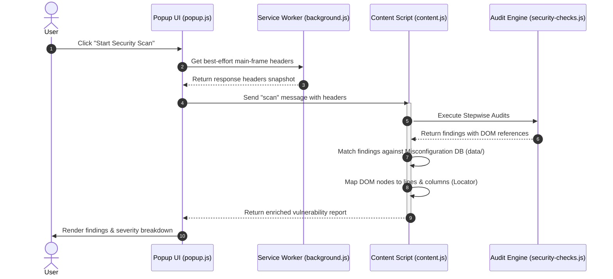

# Inspectra 🛡️
### **Web Security Configuration Auditor**

Inspectra is a modern, high-performance Manifest V3 browser extension designed to perform best-effort client-side security audits of active browser tabs. It dynamically scans the page DOM, evaluates running scripts, and audits security headers and cookie flags to generate comprehensive, actionable security vulnerability reports.

---

## 🚀 Key Features

* **Real-time Security Scanning**: Perform an exhaustive audit of any active website in under a few seconds with a single click.
* **Step-by-Step Progress Tracking**: Transparent UI showing scan progress across multiple security engines.
* **Vulnerability Severity Breakdown**: Categorizes findings into **Critical**, **High**, **Medium**, and **Low** with visual severity indicators.
* **HTML Node & Line-by-Line Evidence**: Automatically locates the exact DOM node and line number in the source document where vulnerabilities (like `eval()`, inline event handlers, or mixed content) occur.
* **Dynamic Database Enrichment**: Enriches scanned findings with an offline database containing **1,000 common misconfiguration templates** mapped to **CWE** (Common Weakness Enumeration) and **OWASP Top 10** categories:
    * **Category 1**: Transport & Headers Security — 100 items
    * **Category 2**: Authentication & Session Management — 100 items
    * **Category 3**: Input Validation & Injection — 100 items
    * **Category 4**: Access Control — 100 items
    * **Category 5**: Cryptography & Data Protection — 100 items
    * **Category 6**: API & Web Services — 100 items
    * **Category 7**: Client-Side Security — 100 items
    * **Category 8**: Configuration & Deployment — 100 items
    * **Category 9**: Third-Party Dependencies — 100 items
    * **Category 10**: Information Disclosure — 100 items
    * *Total: 1,000 unique misconfigurations.*
* **Report Exporting**: Export reports directly to standard JSON format for documentation or ingestion into developer toolchains.
* **Premium UI/UX**: Includes a responsive light/dark theme toggle with state stored locally.

---

## 📊 Extension Architecture

Inspectra uses a decoupled architecture in line with Chrome extension Manifest V3 best practices:



---

## 🔍 Audit & Vulnerability Coverage

Inspectra's security engine (`scripts/security-checks.js`) evaluates findings across several key domains:

| Category | Checks Performed | Severity Range |
| :--- | :--- | :--- |
| **HTTP Headers** | Audits presence and correctness of HSTS, X-Frame-Options, X-Content-Type-Options, Referrer-Policy, Permissions-Policy. | `Medium` to `High` |
| **Content Security Policy** | Detailed analysis of CSP directives (`unsafe-inline`, `unsafe-eval`, wildcards `*`, missing `base-uri`, missing `form-action`, missing `frame-ancestors`, missing `object-src`). | `Medium` to `High` |
| **Cookie Security** | Identifies cookie attributes (checks for insecure HTTP transport, flags sensitive cookie patterns like `session`, `token`, `jwt`, `xsrf`). | `Medium` to `Critical` |
| **Form Security** | Validates forms submitting over unencrypted HTTP, checks for missing CSRF tokens on POST actions, flags file upload fields, and guards sensitive inputs on insecure pages. | `High` to `Critical` |
| **Cross-Site Scripting (XSS)** | Detects Reflected XSS URL parameters, matches XSS payload patterns in inputs, audits potential DOM XSS sinks (`innerHTML`, `outerHTML`, `document.write`), and identifies dynamic code execution (`eval()`). | `High` to `Critical` |
| **Cross-Site Request Forgery (CSRF)** | Checks for state-changing links in GET requests, and flags AJAX requests (fetch/XHR) that lack CSRF header tokens. | `High` |
| **Data Exposure & Mixed Content** | Detects active mixed-content elements (resources loaded over HTTP on HTTPS page) and reports credentials/secrets exposed in client-side code. | `High` to `Critical` |
| **Input Validation** | Verifies basic input constraints like missing length limits (`maxlength`) that could contribute to buffer overflows or application Denial of Service. | `Low` |

---

## 📂 Project Structure

```bash
inspectra/
├── manifest.json                  # Manifest V3 configuration, permissions, and script declarations
├── popup/
│   ├── popup.html                 # Main interface layout
│   ├── popup.css                  # UI theme styles (including light/dark styles)
│   └── popup.js                   # UI logic, progress reporting, and report export actions
├── scripts/
│   ├── background.js              # Service worker capturing network headers and updating badge indicators
│   ├── security-checks.js         # Security audit functions and scanner logic
│   └── content.js                 # Orchestrator injected into the web page (runs checks and locates source lines)
├── data/
│   ├── misconfigurations-category*.js # 10 categorized lists of known misconfigurations (100 items each)
│   └── misconfigurations-index.js # Compiles categories into the global database `globalThis.MISCONFIG_DB`
├── assets/
│   └── icons/                     # Product branding and extension icons (16px, 32px, 48px, 128px)
└── README.md                      # Documentation
```

---

## 🛠️ Installation

Inspectra is loaded as an unpacked developer extension in any Chromium-based browser (Chrome, Edge, Brave, Opera):

1. **Clone or Download** this repository to your local machine.
2. Open your browser and navigate to the Extensions management page:
   * Google Chrome: `chrome://extensions`
   * Microsoft Edge: `edge://extensions`
3. Toggle the **Developer mode** switch (usually top-right).
4. Click the **Load unpacked** button in the top-left toolbar.
5. Select the folder containing `manifest.json`.
6. Inspectra is now ready to use! Pin it to your extension toolbar for quick access.

---

## 💡 Usage

1. Navigate to the website or application page you wish to audit.
2. Click the **Inspectra** shield icon in your browser toolbar.
3. Review the authorization notice and check the box to confirm scan authorization.
4. Click **Start Security Scan**.
5. Once the scan is complete:
   * View the high-level stats and list of findings.
   * Expand individual findings to review descriptions, recommendations, CWE/OWASP mapping, and source code evidence.
   * Click **Export Report** to download the results as a `security-report.json` file.

---

## ⚠️ Important Limitations & Scope

Inspectra is designed as a **first-line helper tool** for developers and security analysts. It is important to understand its constraints:

* **Client-Side Visibility**: Security scanners running inside a browser sandbox cannot inspect backend servers, database systems, or server-to-server communications. Some findings (like cookie `HttpOnly` attributes) are assessed on a best-effort basis.
* **False Positives**: General checks may flag configuration policies (like missing strict headers or generic form inputs) that are intentionally configured that way due to performance, analytics, or legacy dependencies.
* **Restricted Pages**: Browsers block content scripts and header listeners on security-sensitive system URLs (e.g., `chrome://`, `edge://`, `chrome-extension://`, and the Chrome Web Store).

---

## 🐛 Troubleshooting

* **"This page cannot be scanned..."**: Ensure you are on a normal HTTP/HTTPS web page. System pages and browser settings cannot be scanned due to security boundaries.
* **Missing HTTP Headers**: If HTTP headers fail to load, reload the tab and try scanning again. Ensure the tab was fully loaded before clicking the scan button.
* **Applying Code Changes**: If you are developing and editing Inspectra's source files, remember to click the **Reload (circular arrow)** icon on the Inspectra card in `chrome://extensions` to load the updated scripts.

---

## License

Released under the [MIT License](LICENSE) — free to use, modify, and distribute with attribution.

---

<div align="center">

**Built by [Anees Aleideh](https://linkedin.com/in/anees-aleideh)**

[](https://linkedin.com/in/anees-aleideh)

*If you find this useful, consider leaving a ⭐ on the repo.*

</div>
